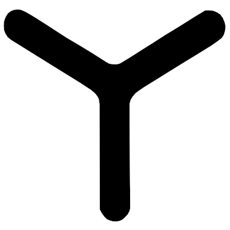

# Arena

Each arena contains three arms. The three arms are arranged so the arena looks
like the letter "Y". A fly is placed in the arena and can walk up and down each
of the three arms. Each arm has three odors, allowing the user to select one of
three odors for each arm at a time. So there are a total of nine odors for each
arena. Three and only three odors are active at any given time, one active odor
for each arena arm.

